# Shell Scripting Hands-on Aux Projects

Shell scripting is a type of programming that involves writing a series of commands in a script file to be executed by a Unix-like shell, such as Bash. It allows users to automate tasks, perform system administration, and streamline repetitive tasks by running multiple commands in sequence. 


## Variables

Shell scripting variables are used to store data, and their values can be accessed by prefixing the variable name with a dollar sign. Variable names are case-sensitive and can contain letters, numbers, and underscores, with the convention of using double quotes to safely handle variable values with spaces or special characters.

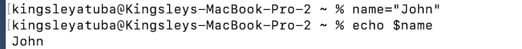


## Control Flow

Control flow in programming refers to the order in which a program's instructions or statements are executed. It involves using conditional statements (if, else, switch) to make decisions and control the program's flow, as well as loops (for, while) to repeat certain blocks of code, allowing for dynamic and structured execution of code based on conditions and iterations.

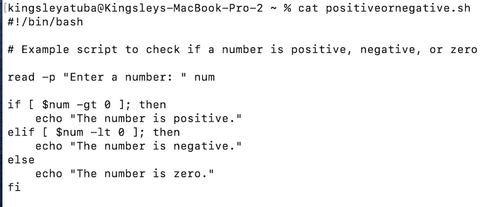

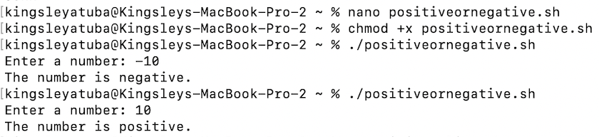

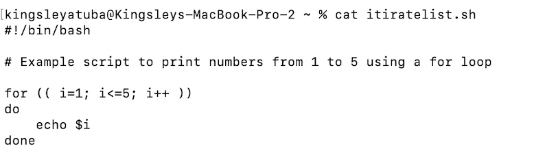

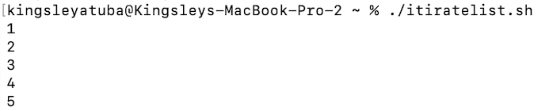


## Command Substitution

Script command substitution, achieved through backticks (`command`) or $() syntax, allows you to capture the output of a command for use as a value within another command or for variable assignment in shell scripting. This technique is valuable for dynamically generating arguments or data for other commands in your script.

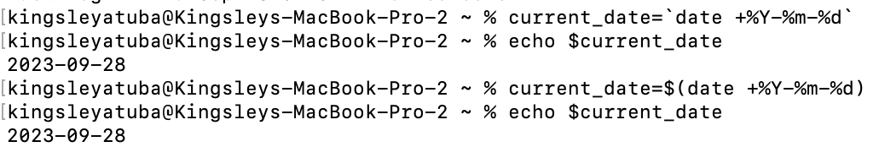

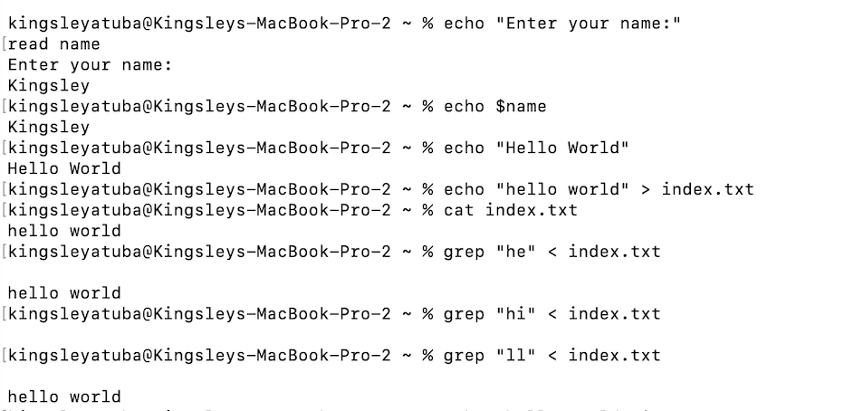

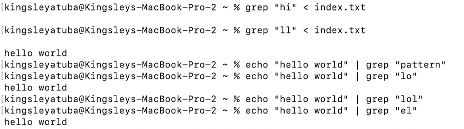


## Functions

Script functions are reusable code blocks that can be defined and called within a Bash script using the function keyword or parentheses. They help improve code organization and reusability by encapsulating specific functionality, making scripts more modular and easier to maintain.

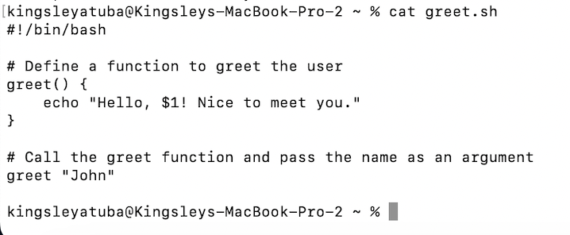

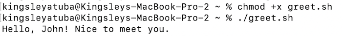


## Our First Shell Script

The provided Bash script prompts the user to enter their name using the echo command and then reads their input using read. It subsequently displays a greeting message that includes the entered name using the echo command.

```bash
#!/bin/bash

# Prompt the user for their name
echo "Enter your name:"
read name

# Display a greeting with the entered name
echo "Hello, $name! Nice to meet you."

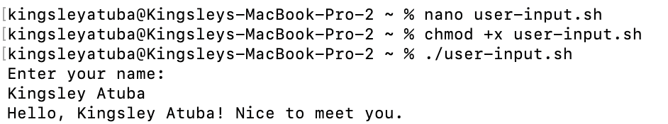

