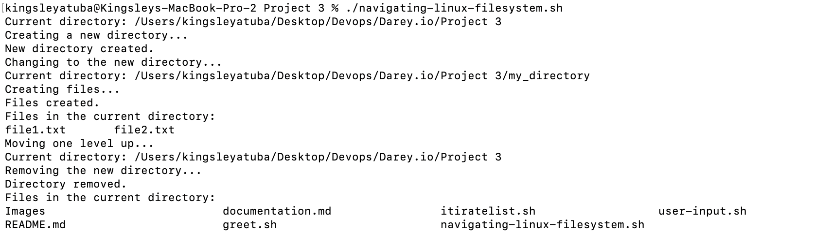
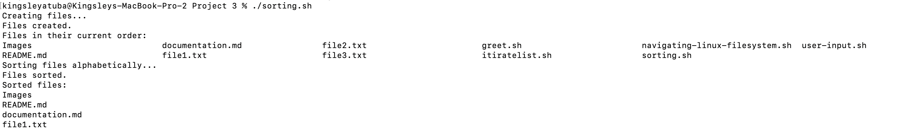
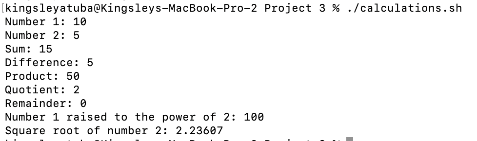
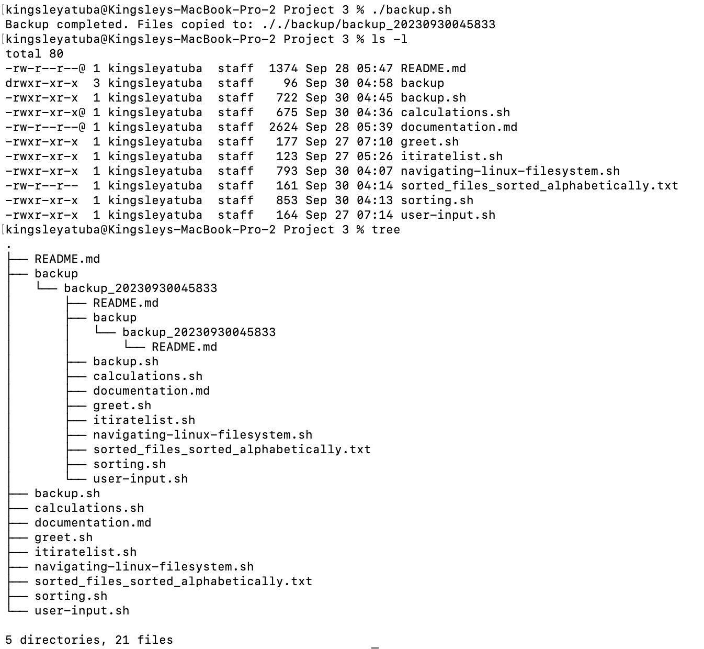

# Shell Scripting Hands-on Aux Projects

Shell scripting is a type of programming that involves writing a series of commands in a script file to be executed by a Unix-like shell, such as Bash. It allows users to automate tasks, perform system administration, and streamline repetitive tasks by running multiple commands in sequence. 


## Variables

Shell scripting variables are used to store data, and their values can be accessed by prefixing the variable name with a dollar sign. Variable names are case-sensitive and can contain letters, numbers, and underscores, with the convention of using double quotes to safely handle variable values with spaces or special characters.


## Control Flow

Control flow in programming refers to the order in which a program's instructions or statements are executed. It involves using conditional statements (if, else, switch) to make decisions and control the program's flow, as well as loops (for, while) to repeat certain blocks of code, allowing for dynamic and structured execution of code based on conditions and iterations.


## Command Substitution

Script command substitution, achieved through backticks (`command`) or $() syntax, allows you to capture the output of a command for use as a value within another command or for variable assignment in shell scripting. This technique is valuable for dynamically generating arguments or data for other commands in your script.


## Functions

Script functions are reusable code blocks that can be defined and called within a Bash script using the function keyword or parentheses. They help improve code organization and reusability by encapsulating specific functionality, making scripts more modular and easier to maintain.


## Our First Shell Script

The provided Bash script prompts the user to enter their name using the echo command and then reads their input using read. It subsequently displays a greeting message that includes the entered name using the `echo` command.

```bash
#!/bin/bash

# Prompt the user for their name
echo "Enter your name:"
read name

# Display a greeting with the entered name
echo "Hello, $name! Nice to meet you."
```


## Directory Manipulation and Navigation

This script will display the current directory, create a new directory called "my _directory," change to that directory, create two files inside it, list the files, move back one level up, remove the "my directory" and its contents, and finally list the files in the current directory again.

step 1: open a file named navigating-linux-filesystem.sh
step 2: paste the code block below into your file.

```bash
#!/bin/bash

# Display current directory
echo "Current directory: $PWD"

# Create a new directory
echo "Creating a new directory..."
mkdir my_directory
echo "New directory created."

# Change to the new directory
echo "Changing to the new directory..."
cd my_directory
echo "Current directory: $PWD"

# Create some files
echo "Creating files..."
touch file1.txt
touch file2.txt
echo "Files created."

# List the files in the current directory
echo "Files in the current directory:"
ls

# Move one level up
echo "Moving one level up..."
cd ..
echo "Current directory: $PWD"

# Remove the new directory and its contents
echo "Removing the new directory..."
rm -rf my_directory
echo "Directory removed."

# List the files in the current directory again
echo "Files in the current directory:"
ls
```

run this code: `sudo chmod +x navigating-linux-filesystem.sh`



## File Operations and Sorting

This script creates three files (file1.txt, file2.txt, and file3.txt), displays the files in their current order, sorts them alphabetically, saves the sorted files in sorted_files.txt, displays the sorted files, removes the original files, renames the sorted file to sorted_files_sorted _alphabetically.txt, and finally displays the contents of the final sorted file.

step 1: Open your terminal and create a file called sorting.sh using the command `nano sorting.sh`
step 2: Copy and paste the code block below into the file

```bash
#!/bin/bash

# Create three files
echo "Creating files..."
echo "This is file3." > file3.txt
echo "This is file1." > file1.txt
echo "This is file2." > file2.txt
echo "Files created."

# Display the files in their current order
echo "Files in their current order:"
ls

# Sort the files alphabetically
echo "Sorting files alphabetically..."
ls | sort > sorted_files.txt
echo "Files sorted."

# Display the sorted files
echo "Sorted files:"
cat sorted_files.txt

# Remove the original files
echo "Removing original files..."
rm file1.txt file2.txt file3.txt
echo "Original files removed."

# Rename the sorted file to a more descriptive name
echo "Renaming sorted file..."
mv sorted_files.txt sorted_files_sorted_alphabetically.txt
echo "File renamed."

# Display the final sorted file
echo "Final sorted file:"
cat sorted_files_sorted_alphabetically.txt
```

run this code: `sudo chmod +x sorting.sh`




## Working with Numbers and Calculations

This script defines two variables num1 and num2 with numeric values, performs basic arithmetic operations (addition, subtraction, multiplication, division, and modulus), and displays the results. It also performs more complex calculations such as raising num1 to the power of 2 and calculating the square root of num2, and displays those results as well. 

step 1: On your terminal create a file called calculations.sh using the command `nano calculations.sh`
step 2: Copy and paste the code block below:

```bash
#!/bin/bash

# Define two variables with numeric values
num1=10
num2=5

# Perform basic arithmetic operations
sum=$((num1 + num2))
difference=$((num1 - num2))
product=$((num1 * num2))
quotient=$((num1 / num2))
remainder=$((num1 % num2))

# Display the results
echo "Number 1: $num1"
echo "Number 2: $num2"
echo "Sum: $sum"
echo "Difference: $difference"
echo "Product: $product"
echo "Quotient: $quotient"
echo "Remainder: $remainder"

# Perform some more complex calculations
power_of_2=$((num1 ** 2))
square_root=$(awk "BEGIN{ print sqrt($num2) }")


# Display the results
echo "Number 1 raised to the power of 2: $power_of_2"
echo "Square root of number 2: $square_root"
```
run this code: `sudo chmod +x calculations.sh`




## File Backup and Timestamping

This shell scripting example is focused on file backup and timestamp. As a DevOps Engineer backing up databases and other storage devices is one of the most common task you get to carryout. This script defines the source directory and backup directory paths. It then creates a timestamp using the current date and time, and creates a backup directory with the timestamp appended to its name. The script then copies all files from the source directory to the backup directory using the cp command with the -r option for recursive copying. Finally, it displays a message indicating the completion of the backup process and shows the path of the backup directory with the timestamp.

step 1: On your terminal open a file backup.sh using the command `nano backup.sh`
step 2: Copy and paste the code block below into the file.

```bash
#!/bin/bash

# Define the source directory and backup directory
source_dir="./"  # The current directory
backup_dir="./backup"  # Directory within the source directory

# Create a timestamp with the current date and time
timestamp=$(date +"%Y%m%d%H%M%S")

# Create the backup directory with the timestamp inside the source directory
backup_dir_with_timestamp="$source_dir$backup_dir/backup_$timestamp"

# Create the backup directory
mkdir -p "$backup_dir_with_timestamp"

# Copy all files from the source directory to the backup directory
cp -r "$source_dir"* "$backup_dir_with_timestamp"

# Display a message indicating the backup process is complete
echo "Backup completed. Files copied to: $backup_dir_with_timestamp"
```
run this code: `sudo chmod +x backup.sh`

